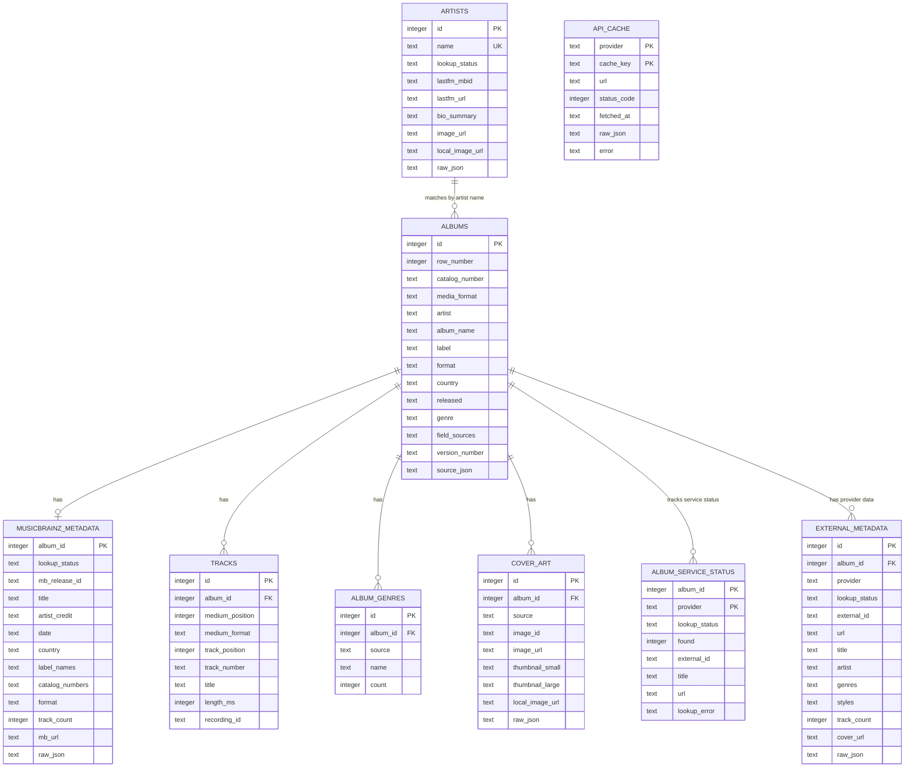
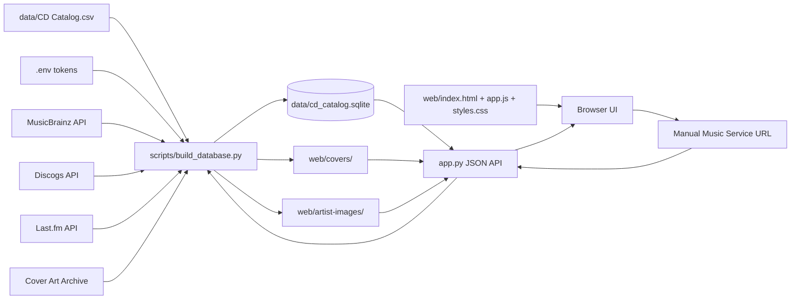

# Radio 1190 Music Archive

A local SQLite-backed browser for the Radio 1190 CD catalog. The app imports `data/CD Catalog.csv`, enriches catalog rows with MusicBrainz, Discogs, and Last.fm metadata, caches API responses locally, downloads usable cover/artist images, and serves a lightweight web interface at `http://127.0.0.1:8000`.

## What It Stores

The original spreadsheet remains the source of truth for supplied catalog rows. The SQLite database extends those rows with a master album record assembled from external services in this priority order:

1. MusicBrainz
2. Discogs
3. Last.fm

The master album fields currently filled from those services are:

- `label`
- `country`
- `released`
- `genre`

`format` is catalog-supplied only. The current catalog assumes every supplied item is a CD, so rebuilds set `albums.format` from the local `media_format` value and do not update it from MusicBrainz, Discogs, or Last.fm.

Every album also keeps provider-specific records so the source data remains inspectable.

## Local Files

| Path | Purpose |
| --- | --- |
| `data/CD Catalog.csv` | Source spreadsheet export. |
| `data/cd_catalog.sqlite` | Generated SQLite database used by the app. |
| `web/` | Static frontend files served by `app.py`. |
| `web/covers/` | Locally cached album cover images. |
| `web/artist-images/` | Locally cached Last.fm artist images. |
| `.env` | Local API tokens. This file should not be committed. |
| `.env.example` | Template showing supported token names. |
| `scripts/build_database.py` | CSV import, schema creation, API enrichment, cache writes, and manual URL enrichment helpers. |
| `app.py` | Local HTTP server and JSON API. |

## Environment

Create `.env` from `.env.example` and add the tokens you have:

```sh
DISCOGS_TOKEN=your_discogs_token
LASTFM_API_KEY=your_lastfm_api_key
```

MusicBrainz does not require a token, but the script identifies itself with a user agent and rate-limits normal MusicBrainz lookups.

## Build The Database

Import the CSV only:

```sh
python3 scripts/build_database.py
```

Import the CSV and enrich the first 50 catalog rows:

```sh
python3 scripts/build_database.py --enrich 50
```

The script uses the `api_cache` table so repeated runs reuse cached API payloads unless `--refresh-cache` is supplied.

## Run The App

```sh
python3 app.py
```

Open:

```text
http://127.0.0.1:8000
```

## Manual Music Service Matching

If a selected album has no matched music services, the sidebar shows a `Music Service URL` field. Paste one of these:

- MusicBrainz release URL, for example `https://musicbrainz.org/release/<release-id>`
- Discogs release URL, for example `https://www.discogs.com/release/<release-id>-...`
- Discogs master URL, for example `https://www.discogs.com/master/<master-id>-...`
- Last.fm album URL, for example `https://www.last.fm/music/<artist>/<album>`

When submitted, the supplied URL becomes the anchor match for that album. Discogs master URLs are resolved through the master record's `main_release`. The app then uses the artist/title from that service to look up the same album in the other two services, stores the results in SQLite, and refreshes the sidebar.

## Web Features

- Click an artist name to show all releases by that artist.
- Click a genre/tag chip to filter by that tag only.
- Click the underlined `genres/tags` count in the header to open the tag cloud.
- Click any tag in the tag cloud to filter by that tag only.
- Click a record label to show all releases from that label.
- `Hide N/A albums` defaults on and hides rows where both artist and album are `N/A`.
- The `Music Service` column lists the services matched for each album.

## Database ERD



## Data And Asset Storage



## API Endpoints

| Endpoint | Method | Purpose |
| --- | --- | --- |
| `/api/albums` | `GET` | List albums with optional filters: `q`, `tag`, `artist`, `label`, `hide_na`, `enriched`, `limit`, `offset`. |
| `/api/albums/<id>` | `GET` | Return one album, service metadata, tracks, genres, covers, and artist profile. |
| `/api/albums/<id>/music-service-url` | `POST` | Submit a MusicBrainz, Discogs, or Last.fm album URL for an unmatched album. |
| `/api/stats` | `GET` | Return high-level catalog stats. |
| `/api/tags` | `GET` | Return tag-cloud data from cached MusicBrainz, Discogs, and Last.fm genre/tag/style records. |

## Notes

- `api_cache` stores raw JSON responses keyed by provider and request, so routine rebuilds avoid unnecessary API calls.
- `external_metadata` stores normalized provider records for MusicBrainz, Discogs, and Last.fm.
- `musicbrainz_metadata` remains separate because MusicBrainz also supplies detailed track and release fields used elsewhere in the app.
- Album art and artist images are stored as local files and referenced by local web paths.
- The app is intended for local use and does not implement authentication.
