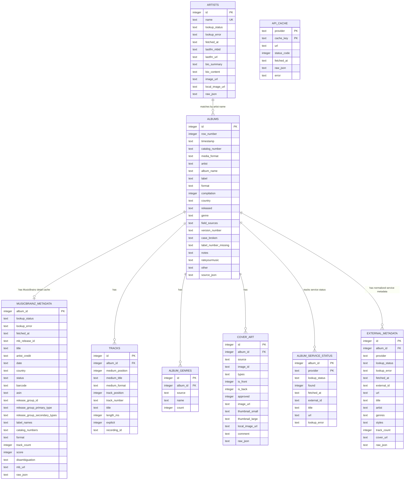
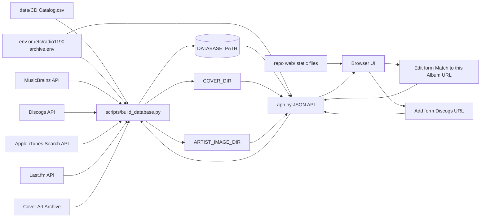

# Radio 1190 Music Archive

A local SQLite-backed browser for the Radio 1190 CD catalog. The app imports `data/CD Catalog.csv`, enriches catalog rows with MusicBrainz, Discogs, Apple iTunes, and Last.fm metadata, caches API responses locally, downloads usable cover/artist images, and serves a lightweight web interface on port `8190`.

## What It Stores

The original spreadsheet remains the source of truth for supplied catalog rows. The SQLite database extends those rows with a master album record assembled from external services in this priority order:

1. Apple iTunes
2. Discogs
3. Last.fm
4. MusicBrainz

The master album fields currently filled from those services are:

- `label`
- `country`
- `released`
- `genre`
- `compilation`

`format` is catalog-supplied only. The current catalog assumes imported spreadsheet items are CDs, and the web Add/Edit form treats `format` as the single user-facing format field. External services can be used to check whether the supplied format appears in API data, but they do not overwrite the catalog format.

Every album keeps normalized provider records in `external_metadata`, one row per matched or attempted service. Apple iTunes, Discogs, Last.fm, and MusicBrainz are peers in that table. Some services also populate service-specific helper tables when they expose richer data; for example, `musicbrainz_metadata` stores detailed MusicBrainz release fields, Discogs/MusicBrainz can populate editable `tracks`, and Apple iTunes can populate or update track explicit-lyrics flags.

`Various`, `V/A`, and `VA` are normalized to the special display value `Various Artists`. Compilation rows suppress artist profile display, and compilation tracks rendered as `Artist - Song` make the track artist clickable for an artist search.

## Local Files

| Path | Purpose |
| --- | --- |
| `data/CD Catalog.csv` | Source spreadsheet export. |
| `data/cd_catalog.sqlite` | Generated SQLite database used by the app unless `DATABASE_PATH` points elsewhere. |
| `web/` | Static frontend files served by `app.py`. |
| `web/covers/` | Locally cached album cover images unless `COVER_DIR` points elsewhere. |
| `web/artist-images/` | Locally cached Last.fm artist images unless `ARTIST_IMAGE_DIR` points elsewhere. |
| `.env` | Local API tokens. This file should not be committed. |
| `.env.example` | Template showing supported token names. |
| `scripts/build_database.py` | CSV import, schema creation, API enrichment, cache writes, and manual URL enrichment helpers. |
| `app.py` | Local HTTP server and JSON API. |

## Environment

Create `.env` from `.env.example` and add the tokens you have:

```sh
DISCOGS_TOKEN=your_discogs_token
LASTFM_API_KEY=your_lastfm_api_key
APP_USERNAME=admin
APP_PASSWORD=change_this_password
```

Optional persistent storage variables:

```sh
DATABASE_PATH=/var/lib/radio1190-archive/data/cd_catalog.sqlite
COVER_DIR=/var/lib/radio1190-archive/covers
ARTIST_IMAGE_DIR=/var/lib/radio1190-archive/artist-images
ENV_PATH=/etc/radio1190-archive.env
```

On a server, use paths outside the repository for the SQLite database and cached images. That lets you update code with `git pull` without replacing live catalog data or downloaded artwork.

MusicBrainz and Apple iTunes do not require tokens, but the script identifies MusicBrainz requests with a user agent. Uncached MusicBrainz, Cover Art Archive, Discogs, Apple iTunes, and Last.fm API calls are throttled so enrichment stays polite to external services.

The web app requires login for the desktop catalog, mobile add page, and every `/api/*` call. If `APP_USERNAME` or `APP_PASSWORD` are not set, the local defaults are `admin` and `radio1190`; change them before listening on your LAN.

The default user is seeded as both an admin and editor. Admins can open `/admin.html` to create users and assign admin and/or editor roles. Editors can add, edit, delete, and manually match catalog items. Users without admin or editor roles can browse only; catalog write APIs return `403`.

## Scripts

The `scripts/` directory contains the maintenance commands for importing data and running the app as a Debian system service.

### `scripts/build_database.py`

Imports `data/CD Catalog.csv`, creates or rebuilds `data/cd_catalog.sqlite`, imports the catalog rows, and optionally enriches albums from MusicBrainz, Discogs, Apple iTunes, and Last.fm.

Import the CSV only:

```sh
python3 scripts/build_database.py
```

Import the CSV and enrich the first 50 catalog rows:

```sh
python3 scripts/build_database.py --enrich 50
```

Use a different CSV or database path:

```sh
python3 scripts/build_database.py --csv path/to/catalog.csv --db data/test_catalog.sqlite
```

Force fresh API calls instead of using cached payloads:

```sh
python3 scripts/build_database.py --enrich 50 --refresh-cache
```

Options:

| Option | Default | Purpose |
| --- | --- | --- |
| `--csv` | `data/CD Catalog.csv` | Spreadsheet export to import. |
| `--db` | `data/cd_catalog.sqlite` | SQLite database to create or rebuild. |
| `--enrich N` | `0` | Enrich the first `N` catalog rows after importing. |
| `--refresh-cache` | off | Ignore cached API JSON and fetch fresh copies. |

Notes:

- This script does not require `sudo`.
- It reads `.env` automatically for `DISCOGS_TOKEN` and `LASTFM_API_KEY`.
- MusicBrainz does not require a token.
- Discogs enrichment is skipped when `DISCOGS_TOKEN` is not set.
- Apple iTunes enrichment does not require an API key.
- Last.fm album and artist enrichment is skipped when `LASTFM_API_KEY` is not set.
- The script rebuilds the main catalog schema each time it runs. API payloads are cached in SQLite during a run and reused on later enrichment calls unless `--refresh-cache` is supplied.
- Uncached provider requests are throttled per service. Cached responses return immediately.
- Cover images are saved under `COVER_DIR`, defaulting to `web/covers/`.
- Artist images are saved under `ARTIST_IMAGE_DIR`, defaulting to `web/artist-images/`.

### `scripts/install_debian_service.sh`

Creates and starts a `systemd` service for the web app on Debian or Debian-like Linux systems.

Run it with `sudo`:

```sh
sudo scripts/install_debian_service.sh
```

The script:

- Writes a service unit to `/etc/systemd/system/radio1190-archive.service` by default.
- Sets the service working directory to this repository.
- Runs `app.py` with Python.
- Loads `/etc/radio1190-archive.env` when it exists.
- Sets `HOST`, `PORT`, `DATABASE_PATH`, `COVER_DIR`, `ARTIST_IMAGE_DIR`, and `ENV_PATH` in the service environment.
- Creates the persistent data and image directories.
- Runs `systemctl daemon-reload`.
- Enables the service at boot.
- Restarts the service immediately.
- Prints `systemctl status` for the service.

Default values:

| Variable | Default | Purpose |
| --- | --- | --- |
| `SERVICE_NAME` | `radio1190-archive` | Name of the systemd service. |
| `APP_DIR` | repository root | Directory containing `app.py`. |
| `RUN_USER` | the sudoing user | Linux user account that runs the app. |
| `PYTHON_BIN` | `/usr/bin/python3` | Python executable used by the service. |
| `HOST` | `0.0.0.0` | Bind address for the web app. |
| `PORT` | `8190` | Port passed to the app. |
| `DATA_DIR` | `/var/lib/radio1190-archive` | Base directory for persistent server data. |
| `ENV_FILE` | `/etc/radio1190-archive.env` | Environment file loaded by systemd and used as `ENV_PATH`. |
| `DATABASE_PATH` | `$DATA_DIR/data/cd_catalog.sqlite` | Live SQLite database path. |
| `COVER_DIR` | `$DATA_DIR/covers` | Live album cover cache path. |
| `ARTIST_IMAGE_DIR` | `$DATA_DIR/artist-images` | Live artist image cache path. |

Override values by setting environment variables before `sudo`. Preserve them with `sudo -E`:

```sh
SERVICE_NAME=radio1190-archive PORT=8190 PYTHON_BIN=/usr/bin/python3 sudo -E scripts/install_debian_service.sh
```

If the app lives somewhere other than the current checkout, set `APP_DIR`:

```sh
APP_DIR=/opt/radio1190-archive RUN_USER=radio1190 sudo -E scripts/install_debian_service.sh
```

This script must use `sudo` because it writes to `/etc/systemd/system/` and runs `systemctl`.

### `scripts/restart_debian_service.sh`

Reloads systemd and restarts the installed service after code or configuration changes.

Run it with `sudo`:

```sh
sudo scripts/restart_debian_service.sh
```

The script:

- Runs `systemctl daemon-reload`.
- Restarts `radio1190-archive.service` by default.
- Prints `systemctl status` for the service.

Use a custom service name when the install script used one:

```sh
SERVICE_NAME=my-archive sudo -E scripts/restart_debian_service.sh
```

This script must use `sudo` because restarting a system service requires root privileges.

## Move Server Data Outside The Repo

Use this once on the Debian server after pulling code that supports `DATABASE_PATH`, `COVER_DIR`, and `ARTIST_IMAGE_DIR`. These commands copy data first and leave the original files in place until you verify the app.

Stop the service:

```sh
sudo systemctl stop radio1190-archive.service
```

Create persistent directories:

```sh
sudo install -d -o "$USER" -g "$USER" /var/lib/radio1190-archive/data
sudo install -d -o "$USER" -g "$USER" /var/lib/radio1190-archive/covers
sudo install -d -o "$USER" -g "$USER" /var/lib/radio1190-archive/artist-images
```

Copy the live database and cached images without deleting the originals:

```sh
cp -n data/cd_catalog.sqlite /var/lib/radio1190-archive/data/
cp -an web/covers/. /var/lib/radio1190-archive/covers/
cp -an web/artist-images/. /var/lib/radio1190-archive/artist-images/
```

Create the server environment file:

```sh
sudo tee /etc/radio1190-archive.env >/dev/null <<'EOF'
DISCOGS_TOKEN=your_discogs_token
LASTFM_API_KEY=your_lastfm_api_key
APP_USERNAME=admin
APP_PASSWORD=change_this_password
DATABASE_PATH=/var/lib/radio1190-archive/data/cd_catalog.sqlite
COVER_DIR=/var/lib/radio1190-archive/covers
ARTIST_IMAGE_DIR=/var/lib/radio1190-archive/artist-images
EOF
```

Use your real token and password values. Keep this file out of git.

Reinstall the systemd unit so it points at persistent storage:

```sh
sudo -E scripts/install_debian_service.sh
```

Verify the service and paths:

```sh
sudo systemctl status radio1190-archive.service --no-pager
sudo journalctl -u radio1190-archive.service -n 80 --no-pager
curl -i http://localhost:8190/
```

After verification, update code with:

```sh
git pull
sudo scripts/restart_debian_service.sh
```

Avoid deployment commands that delete untracked files inside the repo, such as `git clean -fdx`, `git reset --hard` followed by copying a fresh tree, or `rsync --delete`, unless you have confirmed the live database and image directories are outside the repo and backed up.

Recommended backup before major updates:

```sh
sqlite3 /var/lib/radio1190-archive/data/cd_catalog.sqlite ".backup '/var/lib/radio1190-archive/data/cd_catalog-$(date +%F-%H%M).sqlite'"
tar -czf "/var/lib/radio1190-archive/images-$(date +%F-%H%M).tgz" \
  /var/lib/radio1190-archive/covers \
  /var/lib/radio1190-archive/artist-images
```

## Run The App

```sh
python3 app.py
```

Open:

```text
http://127.0.0.1:8190
```

The app listens on `0.0.0.0:8190` by default so it can be reached from your local network. From another device, open `http://<this-computer-ip>:8190`. Override the bind address or port with `HOST=...` or `PORT=...` if needed.

## Mobile Barcode Add

Open the iOS-focused add page on your phone:

```text
http://<server-address>:8190/add.html
```

Tap `Scan UPC` to use the iPhone camera when the browser supports live barcode detection, or enter the UPC manually. The page uses the browser-native `BarcodeDetector` API when UPC/EAN scanning is available and falls back to the locally vendored free ZXing browser scanner for iOS Safari and other browsers without native barcode support. The page looks up the release in Discogs, shows the cover image and metadata, and waits for `Add` before writing the album to the catalog. After a successful add, the page resets and shows a message like `Album Name by Artist has been added to the catalog`.

If the same user is logged in on a desktop and opens `add.html`, the desktop view hides the camera scanner, shows `mobile_qr.png`, and listens for scans from that user's phone. When the phone scans or enters a UPC and Discogs returns a release, the desktop page automatically fills its add form with that release metadata and cover preview.

All add forms require `1190_ID` before the album can be saved.

Camera access generally requires HTTPS or localhost. Manual UPC entry works as a fallback when the page is opened over plain HTTP from another device or camera permission is denied.

## Manual Music Service Matching

Open an album and click `Edit` to manually match the catalog row to a service URL. The Edit form includes a `Match to this Album` field. Paste one of these:

- MusicBrainz release URL, for example `https://musicbrainz.org/release/<release-id>`
- Discogs release URL, for example `https://www.discogs.com/release/<release-id>-...`
- Discogs master URL, for example `https://www.discogs.com/master/<master-id>-...`
- Apple Music album URL, for example `https://music.apple.com/us/album/<album>/<collection-id>`
- Last.fm album URL, for example `https://www.last.fm/music/<artist>/<album>`

Click `Get Album Info` to preview metadata and album art in the Edit form without saving anything to the catalog database. When the form is saved, the supplied URL becomes the anchor match for that album. Discogs master URLs are resolved through the master record's `main_release`. The app then uses the artist/title from that service to look up the same album in the other services, stores the results in SQLite, and refreshes the sidebar.

Manual matches prefer Discogs tracklists when a Discogs release or master record is found. The app reapplies the cached Discogs detail payload after the other service lookups finish so a later MusicBrainz lookup does not erase the Discogs tracklist, then applies Apple iTunes explicit-lyrics flags to matching tracks.

## Add And Edit Albums

Use the header `Add` button to add a new album manually. The Add form can load album data from a Discogs release or master URL only. This keeps new user-created records anchored to Discogs and avoids broad multi-service searching during entry. Existing albums can use the Edit form's `Match to this Album` field with MusicBrainz, Discogs, Apple Music, or Last.fm URLs.

Album detail views include `Edit` and `Delete` buttons. Edit updates the catalog fields stored on `albums`; Delete removes the album and its dependent cached metadata through SQLite foreign-key cascades.

The Add/Edit form includes:

- Spreadsheet/catalog fields such as timestamp, `1190_ID`, artist, album title, version, case status, notes, and other. New albums pre-populate timestamp with the current local date/time.
- Extended catalog fields: label, format, compilation, country, released, and genre.
- Optional album cover upload.

`RateYourMusic` remains stored from the original spreadsheet and appears in read-only album details, but it is not shown in Add/Edit because it is not currently used for enrichment or lookups.

## Web Features

- Click an artist name to show all releases by that artist.
- Click a genre/tag chip to filter by that tag only.
- Click genre/style chips inside Music Services boxes to filter by that tag only.
- Click the underlined `genres/tags` count in the header to open the tag cloud.
- Click any tag in the tag cloud to filter by that tag only.
- Click a record label to show all releases from that label.
- `Hide N/A albums` defaults on and hides rows where both artist and album are `N/A`.
- `Search track names` expands the keyword search to cached track titles when checked.
- The `Music Service` column lists the services matched for each album.
- The catalog `format` value is highlighted when cached API formats do not include that format.
- `Add` opens the Add Album form.
- Album details include `Edit` and `Delete`.
- Compilation track artists are clickable when a track is displayed as `Artist - Song`.
- Album covers and artist images open in a lightbox.
- Artist images and Last.fm bios appear at the bottom of the sidebar when available; long bios are truncated with a full-bio link.
- Apple iTunes metadata is cached server-side. The older client-side preview playback code is still present but currently disabled.

## Database ERD

`external_metadata` is the normalized music-service table. MusicBrainz, Discogs, Apple iTunes, and Last.fm are all represented there as peer providers. `musicbrainz_metadata` is shown separately only because the app still keeps a MusicBrainz-specific release detail cache for richer fields from earlier builds; it is not the master service model.



## Data And Asset Storage



## API Endpoints

| Endpoint | Method | Purpose |
| --- | --- | --- |
| `/api/albums` | `GET` | List albums with optional filters: `q`, `tag`, `artist`, `label`, `hide_na`, `search_tracks`, `enriched`, `limit`, `offset`. |
| `/api/albums` | `POST` | Create an album from Add form fields, optional Discogs URL, and optional cover upload. |
| `/api/albums/<id>` | `GET` | Return one album, service metadata, tracks, genres, covers, and artist profile. |
| `/api/albums/<id>` | `PUT` | Update an album from Edit form fields and optional cover upload. |
| `/api/albums/<id>` | `DELETE` | Delete an album and dependent cached rows. |
| `/api/music-service-preview` | `POST` | Preview Discogs release/master metadata for the Add form without creating a catalog row. |
| `/api/music-service-match-preview` | `POST` | Preview MusicBrainz, Discogs, Apple Music/iTunes, or Last.fm metadata and album art for the Edit form without updating the catalog database. |
| `/api/discogs-barcode-preview` | `POST` | Preview a Discogs release from a UPC barcode for the mobile add page. |
| `/api/scan-events` | `GET`/`POST` | Relay same-user mobile barcode scans to a desktop add page. |
| `/api/login` | `POST` | Create an authenticated session. |
| `/api/logout` | `POST` | End the current authenticated session. |
| `/api/users` | `GET`/`POST` | Admin-only user listing and creation. |
| `/api/albums/<id>/music-service-url` | `POST` | Submit a MusicBrainz, Discogs, Apple Music/iTunes, or Last.fm album URL for an album. |
| `/api/stats` | `GET` | Return high-level catalog stats. |
| `/api/tags` | `GET` | Return tag-cloud data from cached Apple iTunes, Discogs, Last.fm, and MusicBrainz genre/tag/style records. |

## Notes

- `api_cache` stores raw JSON responses keyed by provider and request, so routine rebuilds avoid unnecessary API calls.
- `external_metadata` stores normalized provider records for Apple iTunes, Discogs, Last.fm, and MusicBrainz.
- `musicbrainz_metadata` is a service-specific detail/cache table for MusicBrainz release fields. It does not make MusicBrainz the master service model; MusicBrainz also has a normalized row in `external_metadata` like Apple iTunes, Discogs, and Last.fm.
- `tracks` prefer Apple iTunes when a matching Apple album is found, can fall back to Discogs or MusicBrainz, can be edited in the Add/Edit form, and are marked with `explicit` from Apple iTunes. Discogs compilation tracks are stored as `Artist - Song` so the UI can make the artist portion searchable.
- `album_service_status` records whether each service was found, not found, errored, or not configured.
- Album art and artist images are stored as local files and referenced by local web paths.
- The app requires authenticated sessions. Admin users can create users and assign admin/editor roles; users without admin or editor roles can browse but cannot add, edit, or delete catalog rows.
